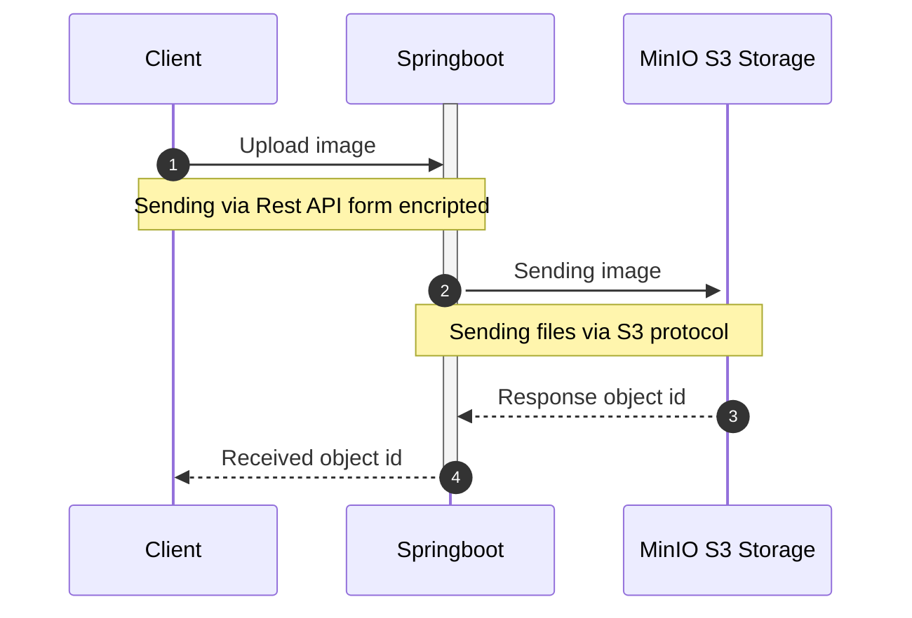
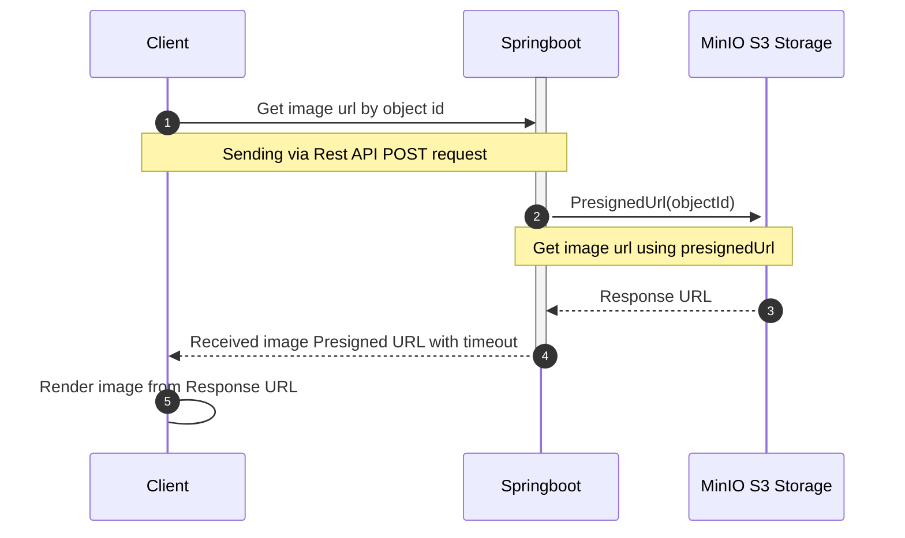

## Angular upload file using [MinIO](https://min.io/)

Example of angular upload/download files using MinIO, you can run locally

```bash
docker-compose --env-file .env.example up -d
```

then run angular project

```bash
npm start
```

## Topologies 

1. Upload document



2.Presigned image URL string to download


